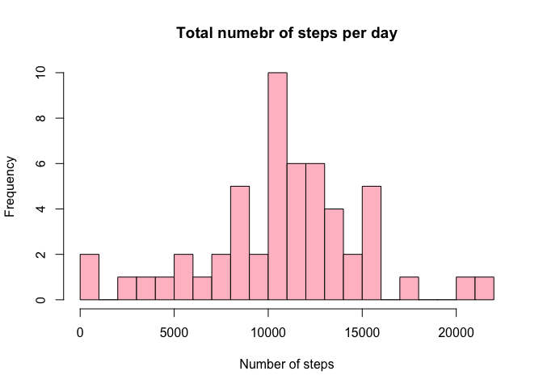
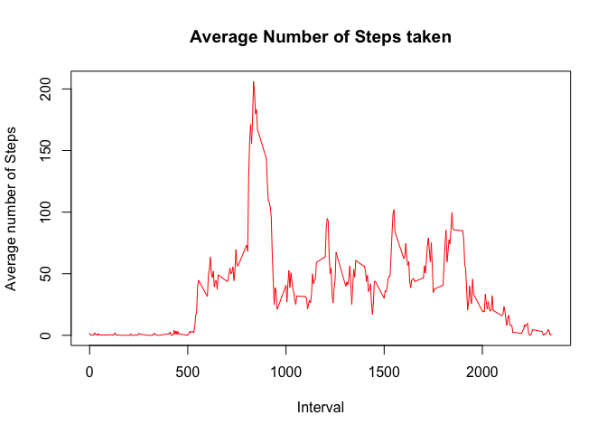
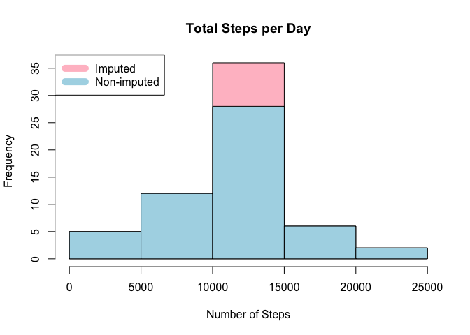
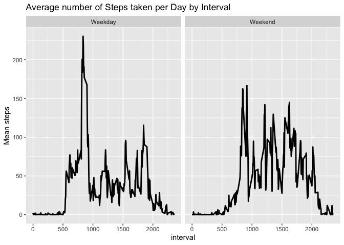

# 1. Loading the data

```r
fileurl = 'https://d396qusza40orc.cloudfront.net/repdata%2Fdata%2Factivity.zip'
if (!file.exists('Activity monitoring data.zip')){
    download.file(fileurl,'Activity monitoring data.zip', method = "curl")
    unzip("Activity monitoring data.zip", exdir = getwd())
}

activity <- read.csv("activity.csv", header = TRUE, sep = ",", na.strings = "NA")

library(knitr)
library(dplyr)
```

```
## 
## Attaching package: 'dplyr'
```

```
## The following objects are masked from 'package:stats':
## 
##     filter, lag
```

```
## The following objects are masked from 'package:base':
## 
##     intersect, setdiff, setequal, union
```

```r
library(ggplot2)
```

## Reading the Data

```r
str(activity)
```

```
## 'data.frame':	17568 obs. of  3 variables:
##  $ steps   : int  NA NA NA NA NA NA NA NA NA NA ...
##  $ date    : chr  "2012-10-01" "2012-10-01" "2012-10-01" "2012-10-01" ...
##  $ interval: int  0 5 10 15 20 25 30 35 40 45 ...
```

# 2. What is mean total number of steps taken per day?
## 1) Calculate the total number of steps taken per day

```r
group_day <- group_by(activity, date)
steps_day <- aggregate(steps ~ date, activity, sum)
head(steps_day, 10)
```

```
##          date steps
## 1  2012-10-02   126
## 2  2012-10-03 11352
## 3  2012-10-04 12116
## 4  2012-10-05 13294
## 5  2012-10-06 15420
## 6  2012-10-07 11015
## 7  2012-10-09 12811
## 8  2012-10-10  9900
## 9  2012-10-11 10304
## 10 2012-10-12 17382
```

## 2) Make a histogram of the total number of steps taken each day

```r
hist(as.numeric(steps_day$steps), breaks = 20, main = "Total numebr of steps per day", xlab = "Number of steps", col = "pink" )
```

<!-- -->

## 3) Mean and median number of steps taken each day

```r
summary(steps_day$steps)
```

```
##    Min. 1st Qu.  Median    Mean 3rd Qu.    Max. 
##      41    8841   10765   10766   13294   21194
```
Median: 10765, Mean: 10766


# 3. What is the average daily activity pattern?
## 1) Make a time series plot (type = "l") of the 5-minute interval (x-axis) and the average number of steps taken, averaged across all days (y-axis)

```r
steps_interval <- aggregate(steps ~ interval, activity, mean)
plot(steps_interval$interval,steps_interval$steps, type="l", xlab="Interval", ylab="Average number of Steps",main="Average Number of Steps taken", col = "red")
```

<!-- -->

## 2) Which 5-minute interval, on average across all the days in the dataset, contains the maximum number of steps?

```r
max_steps <- max(steps_interval$steps)
print(max_steps)
```

```
## [1] 206.1698
```

```r
maximum_interval <- steps_interval[which.max(steps_interval$steps),1]
maximum_interval
```

```
## [1] 835
```
On average, the interval 835 has the maximum average number of steps.

# 4. Imputing missing values
## 1) Find the total number of missing values

```r
all_missing <- !complete.cases(activity)
sum(all_missing)
```

```
## [1] 2304
```

```r
sum(is.na(activity$steps))
```

```
## [1] 2304
```

```r
sum(is.na(activity$date))
```

```
## [1] 0
```

```r
sum(is.na(activity$interval))
```

```
## [1] 0
```
Total missing "steps" variables are 2304.

## 2) Devise a strategy for filling in all of the missing values in the dataset. The strategy does not need to be sophisticated. For example, you could use the mean/median for that day, or the mean for that 5-minute interval, etc.
Replace the missing values by th mean for the day

```r
mean_steps <- aggregate(steps ~ interval, data = activity, FUN = mean)
filling <- numeric()
for (i in 1:nrow(activity)) {
    observation <- activity[i, ]
    if (is.na(observation$steps)) {
        steps <- subset(mean_steps, interval == observation$interval)$steps
    } else {
        steps <- observation$steps
    }
    filling <- c(filling, steps)
}
```

## 3) Create a new dataset which is the same as the original dataset but without missing values

```r
new_data <- activity
new_data$steps <- filling
```

## 4) Histogram of the total number of steps taken each day for the new dataset

```r
total <- aggregate(steps ~ date, new_data, sum, na.rm = TRUE)

hist(total$steps, main = "Total Steps per Day", col="pink", xlab="Number of Steps")

hist(steps_day$steps, main = "Total Steps Each Day", col="light blue", xlab="Number of Steps", add=TRUE)
legend("topleft", c("Imputed", "Non-imputed"), col=c("pink", "light blue"), lwd=10)
```

<!-- -->

## 5) Do these values differ from the estimates from the first part of the assignment? What is the impact of imputing missing data on the estimates of the total daily number of steps?

```r
summary(total$steps)
```

```
##    Min. 1st Qu.  Median    Mean 3rd Qu.    Max. 
##      41    9819   10766   10766   12811   21194
```

```r
summary(steps_day$steps)
```

```
##    Min. 1st Qu.  Median    Mean 3rd Qu.    Max. 
##      41    8841   10765   10766   13294   21194
```
The impact of missing data on estimation is insignificant.

# 5. Are there differences in activity patterns between weekdays and weekends?

## 1) Create a new factor variable in the dataset with two levels – “weekday” and “weekend” indicating whether a given date is a weekday or weekend day.

```r
weekdays <- c("Monday", "Tuesday", "Wednesday", "Thursday", "Friday")
new_data$dow = as.factor(ifelse(is.element(weekdays(as.Date(new_data$date)),weekdays), "Weekday", "Weekend"))
total <- aggregate(steps ~ interval + dow, new_data, mean)
```

## 2) Panel plot comparing the average number of steps taken per 5-minute interval across weekdays and weekends

```r
ggplot(total, aes(x = interval, y = steps)) + geom_line(size  = 1) + ggtitle("Average number of Steps taken per Day by Interval") + ylab("Mean steps") + facet_grid(. ~ dow)
```

<!-- -->
